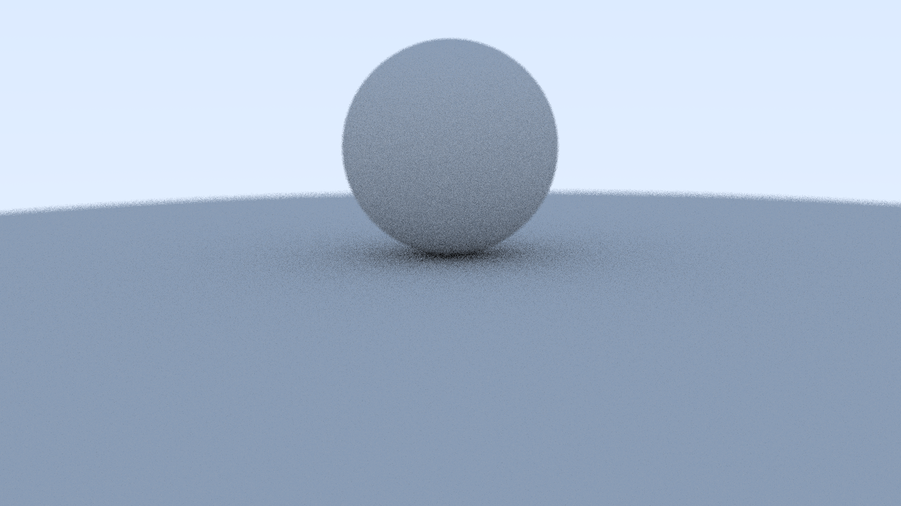
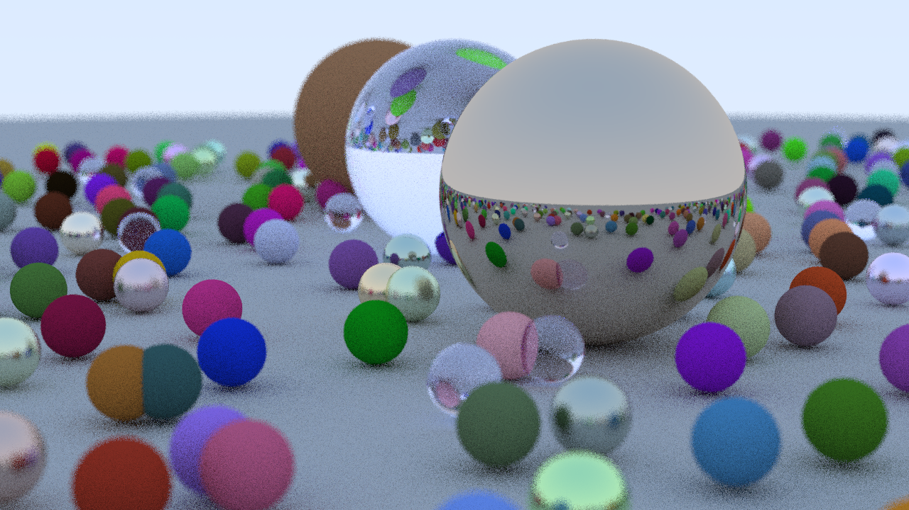

# SwiftRTOW
Peter Shirley's ray tracer from his mini-book [Ray Tracing in One Weekend](https://github.com/RayTracing/raytracing.github.io/) (RTOW). Versions for *Swift on Windows* and *Swift Playgrounds 4*.

### Galery

|RTOW samples|To reproduce see [below](#usage-on-windows)|   |
|:---|:---|:---|
|Image from chaper 8|Image from chapter 10|Final image from book|
||||

### Tools
Apps used on iPad
- [Swift Playgrounds 4](https://apps.apple.com/de/app/swift-playgrounds/id908519492)
- [Working Copy](https://workingcopyapp.com/)
- [Textastic](https://www.textasticapp.com/) (can handle files in *Swift Playgrounds 4* and *Working Copy* folders)
- [GitHub](https://apps.apple.com/us/app/github/id1477376905)

Apps used on Winos 10
- [Swift on Windows](https://www.swift.org/blog/swift-on-windows/) 5.6[^1]
- [ImageMagick](https://imagemagick.org/script/download.php) 7

[^1]: Swift concurrency does not work in 5.5 ([post](https://forums.swift.org/t/swift-concurrency-dep-access-violation-on-task-deallocation/54224))

### Branches
- `swindows` (this)

  *Swift Playgrounds 4* only. Won't compile in *Swift on Windows*.
- `main`

  *Swift Playgrounds 4* and *Swift on Windows*. Renders (SP4)/ outputs (SoW) image from chapter 13 in view/ on stdout.

### Setup
- Create repository on GitHub (default settings)
- Clone repository from GitHub

  **Cygwin command prompt (bash)**
  ```
  git clone https://github.com/otabuzzman/SwiftRTOW.git

  cd SwiftRTOW
  ```
- Swift package initialization

  **Winos command prompt (CMD)**
  ```
  cd SwiftRTOW

  swift package init --type executable

  rem check (Hello world)
  swift run
  ```

### Usage on Windows
- Clone repository from GitHub
- Run commands in top-level directory

  ```
  rem run (background) implies build
  rem default configuration is debug
  swift run >rtow-c13.ppm

  rem foreground run
  .build\debug\SwiftRTOW.exe >rtow-c13.ppm

  rem build for production
  swift build --configuration release

  rem convert result to PNG
  magick rtow-c13.ppm rtow-c13.png

  rem show result
  cmd /c rtow-c13.png
  ```
  To render images for chapter 8 and 10 replace class `C13` in file `Rtow.swift` by `Ch8` and `Ch10` respectively. Re-run commands from above accordingly.

### Usage in Swift Playgrounds 4
- Ceate new app[^2] in SP4
- Delete predefined `*.swift` files in app
- Copy&paste Swift files from repository to app

  - Get repository on iPad (Working Copy)
  - Copy files from WC to SP4 folder (Textastic)

[^2]: Running the code in a Playground crashes.
